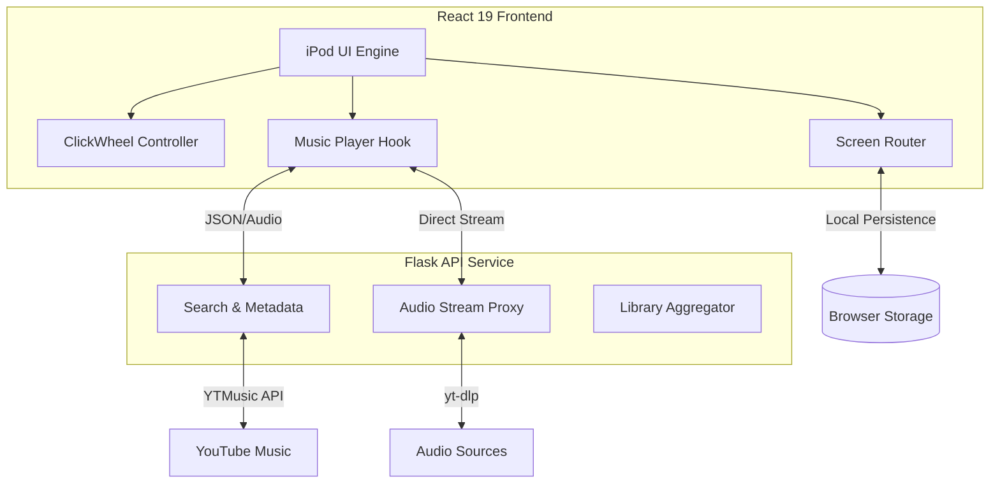

# 🎵 Karan's iPod Classic

<p align="center">
  
</p>

<p align="center">
  <a href="https://github.com/kwakhare5/Karan-s-iPod"></a>
  <a href="https://opensource.org/licenses/MIT"></a>
  <a href="https://react.dev/"></a>
  <a href="https://vitejs.dev/"></a>
  <a href="https://www.python.org/"></a>
</p>

<p align="center">
  <b>Experience the nostalgia of the classic iPod, reimagined for the modern web.</b><br>
  A high-fidelity, hardware-native emulator featuring a functional ClickWheel, real-time YouTube Music streaming, and a full productivity suite.
</p>

---

## 🌟 Elite Features

- **🎯 Precision ClickWheel**: Meticulously engineered circular scroll-and-click mechanics with haptic visual feedback.
- **🎧 Dynamic Streaming**: Robust Python backend bridge utilizing `ytmusicapi` and `yt-dlp` for high-quality audio fetching.
- **📱 Universal Compatibility**: Fluid, responsive design optimized for desktop mouse precision and mobile touch gestures.
- **📦 Feature-Rich Ecosystem**:
  - **Music Player**: Interactive Now Playing screen with scrubber and volume control.
  - **Global Search**: Search the entire YouTube Music library directly from the device.
  - **Library Management**: Curated Artists, Albums, and Genres views with custom Playlist support.
  - **Productivity**: Integrated Notes, Contacts, and Clock applications.
- **⚡ Performance Core**: Built with **Vite** and **React 19** for sub-100ms transitions and buttery smooth 60fps animations.
- **🛠️ Self-Healing Architecture**: Automated backend keep-awake logic ensures consistent availability on cloud providers.

---

## 🎮 Interface Guide

The interaction model perfectly mirrors the original hardware logic:

- **Circular Scroll**: Move your cursor/finger around the ClickWheel to navigate lists with precision.
- **Center Button**: Select items, confirm actions, or trigger playback.
- **MENU Button**: Navigate back through the hierarchy or return to the main menu.
- **PLAY/PAUSE**: Instant playback control from any screen.
- **Next/Prev**: Skip tracks or restart the current song using dedicated hardware mapping.

---

## 🏗️ Architectural Overview



---

## 🚀 Installation & Setup

### Prerequisites

- **Node.js** (v18+)
- **Python** (v3.11+)

### 1. Clone & Initialize

```bash
git clone https://github.com/kwakhare5/Karan-s-iPod.git
cd Karan-s-iPod
npm install
pip install -r backend/requirements.txt
```

### 2. Launch Development Environment

Run the following in separate terminal sessions:

**Backend Service**

```bash
npm run backend
```

**Frontend Application**

```bash
npm run dev
```

Visit **[localhost:5173](http://localhost:5173)** to begin.

---

## 🛠️ Elite Tech Stack

| Layer          | Technology                                                   |
| :------------- | :----------------------------------------------------------- |
| **Framework**  | React 19 (Server-Ready, Functional Components)               |
| **Styling**    | Vanilla CSS + Tailwind (Design Token Architecture)           |
| **State**      | React Context + Custom Hooks (useNavigation, useMusicPlayer) |
| **Backend**    | Python 3.11 / Flask / Pydantic                               |
| **Streaming**  | yt-dlp & ytmusicapi (v5 Direct Proxy Logic)                  |
| **Build Tool** | Vite 6.0                                                     |

---

## 📄 License

Distributed under the **MIT License**. See `LICENSE` for more information.

---

<p align="center">
  Designed & Engineered with ❤️ by <b>Karan</b>
</p>
