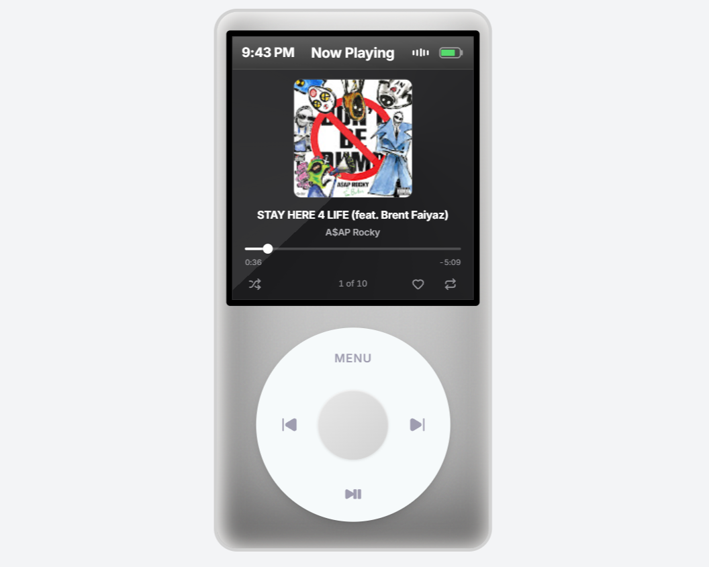
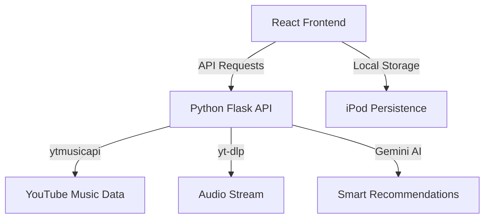

# 🎵 Karan's iPod

<p align="center">
  
</p>

<p align="center">
  <b>Return to the golden era of portable music.</b><br>
  A pixel-perfect, hardware-native iPod Classic emulator built with modern web technologies.
</p>

<p align="center">
  
  
  
  
  
</p>

---

## ✨ Features

- **🎯 Hardware-Native Interaction**: Fully functional ClickWheel with high-fidelity circular scroll-and-click mechanics.
- **🎧 Seamless Streaming**: Direct integration with YouTube Music via a specialized Python bridge (`ytmusicapi` + `yt-dlp`).
- **📱 Responsive Excellence**: Optimized for desktop mouse interaction and mobile touch gestures with pixel-perfect integer alignment.
- **📦 Full Ecosystem**: Includes a built-in Music Player, Search, Library Management, Clock, Notes, and a Contacts app.
- **⚡ Performance First**: Built with Vite and React 19 for instantaneous navigation and smooth 60fps animations.
- **🛠️ Self-Healing Backend**: Automated keep-awake strategy to prevent free-tier sleep on hosting providers.

---

## 🎮 Navigation Guide

The interface is designed to be tactile and intuitive, mirroring the original device logic.

- **Wheel Scroll**: Move your mouse or finger in a circular motion around the wheel to navigate lists.
- **MENU Button**: Navigate back to the previous screen or root menu.
- **Center Button**: Select items, enter sub-menus, or play highlighted tracks.
- **PLAY/PAUSE**: Instant playback toggle from any screen.
- **Next/Prev**: Skip tracks or jump back with dedicated hardware-mapped buttons.

---

## 🚀 Quick Start

### Prerequisites

- **Node.js** (v18+)
- **Python** (v3.11+)

### Installation

1. **Clone the Project**

   ```bash
   git clone https://github.com/kwakhare5/Karan-s-Ipod.git
   cd Karan-s-Ipod
   ```

2. **Setup Frontend**

   ```bash
   npm install
   ```

3. **Setup Backend**

   ```bash
   pip install -r backend/requirements.txt
   ```

4. **Environment Configuration**
   Create a `.env.local` file in the root and add your keys:
   ```env
   GEMINI_API_KEY=your_key_here
   ```

### Running Locally

Open two terminals and run:

**Terminal 1: Backend**

```bash
npm run backend
```

**Terminal 2: Frontend**

```bash
npm run dev
```

Visit **[localhost:5173](http://localhost:5173)** to start your journey.

---

## 🏗️ Architecture



---

## 🛠️ Technology Stack

| Layer           | Technology                                |
| :-------------- | :---------------------------------------- |
| **Framework**   | React 19 (Functional Components + Hooks)  |
| **Language**    | TypeScript (Strict Mode)                  |
| **Styling**     | Tailwind CSS (Utility-First Architecture) |
| **Build Tool**  | Vite                                      |
| **Backend**     | Python 3.11 / Flask                       |
| **Audio**       | yt-dlp & ytmusicapi                       |
| **Persistence** | LocalStorage (iPod Native Persistence)    |

---

## 📁 Project Structure

```text
Karan's iPod/
├── src/
│   ├── features/         # Domain-driven feature modules
│   │   ├── music/        # Player, Search, Library
│   │   ├── navigation/   # ClickWheel, Router, Menus
│   │   ├── settings/     # Appearance, System Config
│   │   └── extras/       # Notes, Contacts, Clock
│   └── shared/           # Cross-cutting components & types
├── backend/              # Unified Python API & Scripts
├── public/               # High-fidelity assets & seed data
└── package.json          # Dependency management
```

---

## 📄 License & Credits

- This project is licensed under the **MIT License**.
- Visually inspired by the iconic **Apple iPod Classic**.
- Developed with meticulous attention to detail by **Karan**.

---

<p align="center">
  Built with ❤️ for the nostalgic music lover.
</p>
