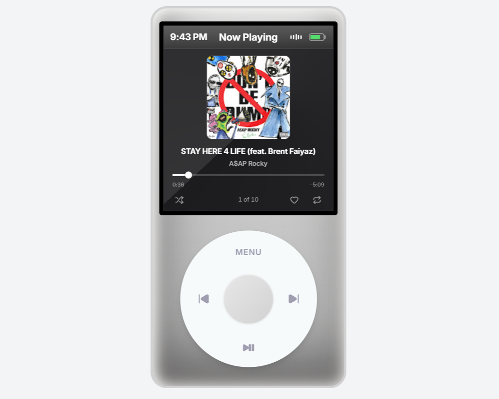
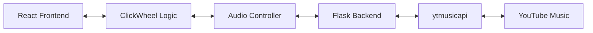

<!-- ╔══════════════════════════════════════════════════════════════════╗
     ║          Karan's iPod Classic — README                              ║
     ║          Reimagining the nostalgia of the classic iPod for the web  ║
     ╚══════════════════════════════════════════════════════════════════╝ -->

<div align="center">

  <!-- LOGO -->
  <!--  -->
  <!-- <br/> -->

  # Karan's iPod Classic

  ### *The nostalgia of the classic iPod, reimagined for the modern web.*

  <br/>

  
  
  
  
  

  <br/>

  <a href="#-about-the-project">About</a> &nbsp;·&nbsp;
  <a href="#-demo">Demo</a> &nbsp;·&nbsp;
  <a href="#-features">Features</a> &nbsp;·&nbsp;
  <a href="#-tech-stack">Tech Stack</a> &nbsp;·&nbsp;
  <a href="#-quickstart">Quickstart</a> &nbsp;·&nbsp;
  <a href="#-contributing">Contributing</a> &nbsp;·&nbsp;
  <a href="#-author">Author</a>

</div>

---

## 🎬 Demo

<div align="center">
  
</div>

<br/>

---

## 📌 About the Project

**Karan's iPod Classic** is a **Hardware-native iPod Emulator** built with **React 19 & Python 3.11**.

Experience the nostalgia of the classic iPod, reimagined for the modern web. This high-fidelity emulator features a functional ClickWheel, real-time YouTube Music streaming, and a full productivity suite. Built with Vite and React 19 for sub-100ms transitions and buttery smooth 60fps animations.

> **Why this project?**
> To bridge the gap between retro hardware tactile feel and modern streaming convenience.

<br/>

---

## ✨ Features

| Status | Feature | Description |
|:---:|---|---|
| ✅ | **Precision ClickWheel** | Meticulously engineered circular scroll-and-click mechanics with haptic visual feedback. |
| ✅ | **Dynamic Streaming** | Robust Python backend bridge utilizing `ytmusicapi` and `yt-dlp` for high-quality audio fetching. |
| ✅ | **Universal Compatibility** | Fluid, responsive design optimized for desktop mouse precision and mobile touch gestures. |
| ✅ | **Feature-Rich Ecosystem** | Integrated Music Player, Global Search, Library Management, and integrated Productivity tools. |
| ✅ | **Self-Healing Architecture** | Automated backend keep-awake logic ensures consistent availability on cloud providers. |

<br/>

---

## 🛠️ Tech Stack

<div align="center">

### Core


### Infrastructure


</div>

<br/>

| Layer | Technology | Purpose |
|---|---|---|
| **Language** | TypeScript | Core Logic & UI Components |
| **Framework** | React 19 | High-performance UI Components |
| **Styling** | Tailwind CSS | Design Token Architecture & Rapid Layout |
| **API / Engine** | Flask / yt-dlp | Audio streaming & YouTube Music integration |
| **Deployment** | Render | Cloud hosting for backend and frontend |

<br/>

---

## 🏗️ Architecture


```mermaid
flowchart LR
    A[React Frontend] <--> B[ClickWheel Logic]
    B <--> C[Audio Controller]
    C <--> D[Flask Backend]
    D <--> E[ytmusicapi]
    E <--> F[YouTube Music]
```

<br/>

---

## 📁 Project Structure

```
Karan-s-Ipod/
│
├── package.json              # Project manifest and scripts
├── src/
│   ├── components/
│   │   └── ClickWheel.tsx    # ClickWheel logic and UI
│   └── hooks/
│       ├── useNavigation.ts  # Screen navigation logic
│       └── useMusicPlayer.ts # Music playback state
│
├── screenshots/              # UI previews and icons
└── README.md
```

<br/>

---

## 🚀 Quickstart

### Prerequisites

- **Node.js v18+** — Required for the React frontend
- **Python 3.11+** — Required for the Flask backend

<br/>

### Step 1 — Clone

```bash
git clone https://github.com/kwakhare5/Karan-s-Ipod.git
cd Karan-s-Ipod
```

### Step 2 — Install Dependencies

Install both Node.js and Python dependencies.

```bash
npm install && pip install -r requirements.txt
```

### Step 3 — Run Locally

Start the backend and frontend development servers in separate terminals.

```bash
npm run backend # Terminal 1
npm run dev     # Terminal 2
```

<br/>

---

## 🤝 Contributing

1. **Fork** the repository
2. **Create** your feature branch (`git checkout -b feature/your-feature`)
3. **Commit** using [Conventional Commits](https://www.conventionalcommits.org/) (`git commit -m "feat: add your feature"`)
4. **Push** (`git push origin feature/your-feature`)
5. **Open a Pull Request**

<br/>

---

## 🛡️ Disclaimer

> This project is an unofficial emulator and is not affiliated with Apple Inc. or YouTube. It is for educational and nostalgic purposes only.

<br/>

---

## 📄 License

Distributed under the **MIT License**. See `LICENSE` for the full text.

<br/>

---

## 👨‍💻 Author

<div align="center">

### Karan Wakhare
*Full Stack Engineer*

<br/>

[](https://www.linkedin.com/in/karanwakhare)
[](https://x.com/kwakhare5)
[](mailto:kwakhare5@gmail.com)
[](https://github.com/kwakhare5)

<br/>


<br/>


</div>

<br/>

---

<div align="center">

  Made with ❤️ by [Karan Wakhare](https://github.com/kwakhare5)

  <br/>

  *"Nostalgia is a file that removes the rough edges from the good old days."*

  <br/>

  

</div>
